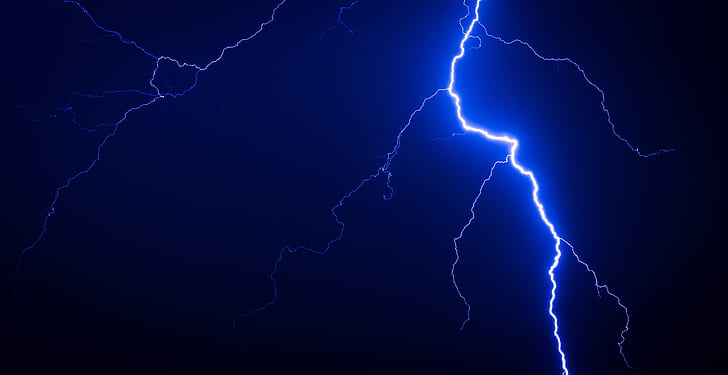

# Image Addition with opencv
In this project I combine a lightning image with an image of iron man to create a super cool image in which iron man is standing and lightning is cracking  
Raw images:  
 
  
 
  
 
Final image:  
 

